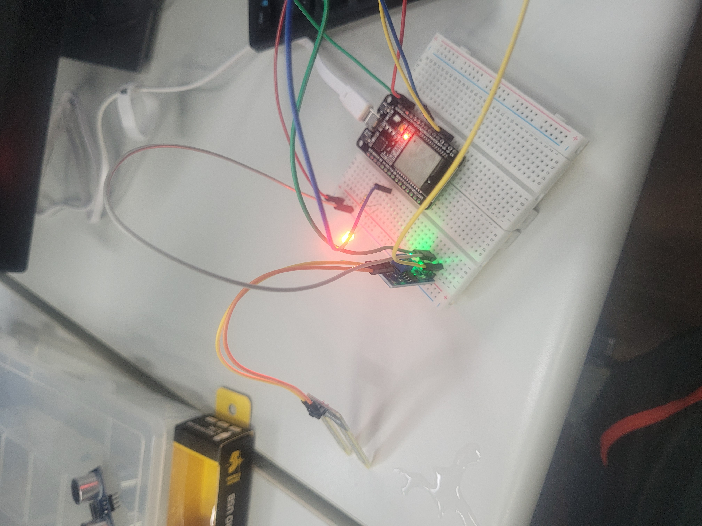
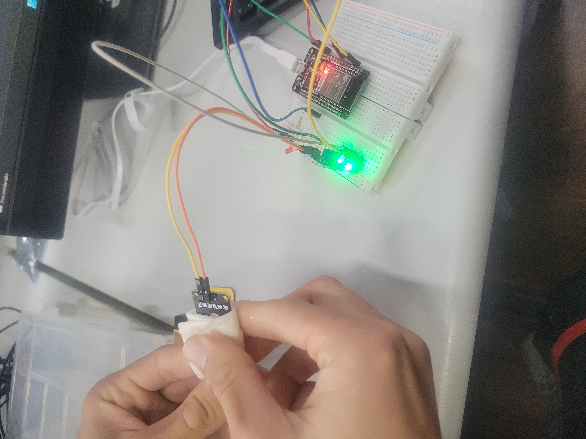

# Projeto Luminosidade

Este repositório contém projetos práticos de Internet Indutrial das Coisas (IIoT) desenvolvidos cmo exercícios de apredizagem, utilizando sensores simples para autoação e monitoramento.

---

## 1. Detecção de Luminosidade com LDR

### Descrição:
Circuito com LDR e LED. O LED acende automaticamente em ambientes escuros e apaga em ambientes claros.

### Componentes:
- LDR (Light Dependent Resistor)
- LED
- Resistor
- Protoboard e Jumpers

### Como funciona:
O LDR vai medir a intensidade da luz. Quando a luminosidade estiver abaixo de um determinado limiar, o LED acende. Quando a luminosidade aumentar, o LED apaga. 

---

## 2. Detecção de Obstáculos com HC-SR04

### Descrição:
Circuito com sensor ultrassônico HC-SR04 e LED. O LED acende automaticamente quando detecta um obstáculo ou intruso próximo.

### Componentes:
- HC-SR04
- LED
- Resistor
- Protoboard e Jumpers

### Como funciona:
O HC-SR04 mede a distância até um objeto usando ultrassom. Se o objeto estiver dentro do limite definido, o LED acende. Caso contrário, o LED permanece desligado.

### Tecnologias:
- ESP32

---

## 3. Monitoramento de Umidade

### Descrição:
Circuito com sensor de umidade para medir a umidade do solo ou do ambiente, com saída digital ou analógica

### Componentes:
- Sensor de Umidade Capacitivo
- LED
- Resistor
- Protoboard e Jumpers

### Como funciona:
O sensor detecta níveis de umidade; dependendo do valor, irá acionar o LED para indicar baixa ou alta umidade.

### Tecnologias:
- ESP32

---

## 4. Contagem de Frascos em Esteira

### Descrição:
Solução para a Alpha Corp, indústria de cosméticos, que embala sempre 10 frascos por caixa.

### Componentes:
- Sensor HC-SR04
- LED
- Protoboard e Jumpers

### Como funciona:
O circuito deve identificar e incrementar sempre que um objeto (frasco) passar pela esteira. Ao atingir 10 frascos, deve contar como uma caixa completa.

### Tecnologias:
- ESP32